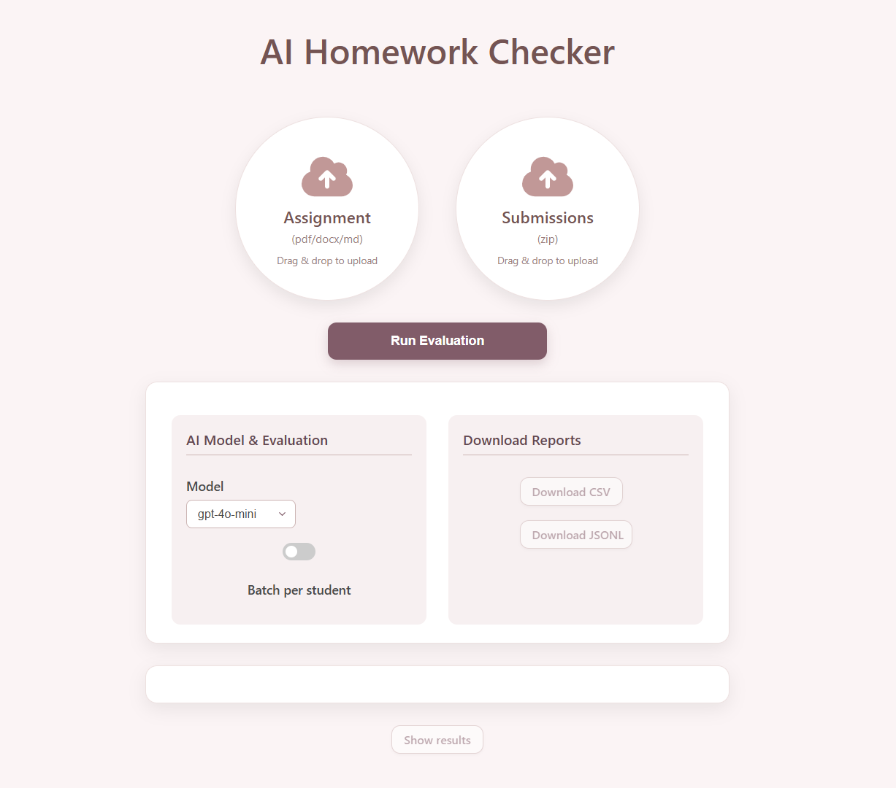

# ai_hw_checker


AI Homework Checker is a **generic, extensible system** designed to automatically evaluate academic homework submissions.  
The project started with **code assignments (Python)** but was built in a way that can easily extend to other domains.

**Current Status:**

✅ Assignment parsing and task extraction.

✅ Student submission evaluation.

✅ Validation and result export (JSON/CSV).

⏳ AI plagiarism detection – coming soon!

---

## 🖥️ UI Overview

<div align="center">
  
</div>

## 🎬 Demo

**Here’s a quick demo video of the system in action:**

<video controls width="800" muted playsinline>
  <source src="https://raw.githubusercontent.com/AdanSul/ai_hw_checker/main/demo/demo.mp4" type="video/mp4" />
  If the video doesn’t load, <a href="https://raw.githubusercontent.com/AdanSul/ai_hw_checker/main/demo/demo.mp4">download it here</a>.
</video>

👉 [Watch the demo video](./demo/demo.mp4)
---

## 📂 Submission Structure

Put all student submissions inside one main folder (for example: `submissions/`).  
Each student should have their **own folder** inside it, named with their ID.  
Inside that folder, place all the files they submitted.

Example:

```text
submissions/
├── student1/
│   ├── task1.py
│   ├── task2.py
│   └── ...
├── student2/
│   ├── task1.py
│   ├── task2.py
│   └── ...
└── ...
```

## ⚙️ Installation

Clone the repo and install dependencies:

```bash
git clone https://github.com/AdanSul/ai_hw_checker.git
cd ai_hw_checker
pip install -r requirements.txt
```

## 🔑 Environment Variables
Create a `.env` file in the project root with the following content:
```bash
OPENAI_API_KEY=your_api_key_here
```
This key is required for the evaluation agents.<br>
(You can get an API key from [OpenAI](https://platform.openai.com/settings/organization/api-keys))
 


## 🚀 How to Run

You can run the system either from the command line or through the UI.

**🔹Command Line:**
```bash
python evaluate.py
```

**🔹UI Mode:**

Backend:
```bash
uvicorn backend.main:app --reload
```

Frontend:
```bash
cd frontend
python -m http.server 9000
```


## 🤝 Contributing

Pull requests and feature suggestions are welcome.
If you’d like to collaborate on expanding plagiarism detection or UI, feel free to open an issue.
